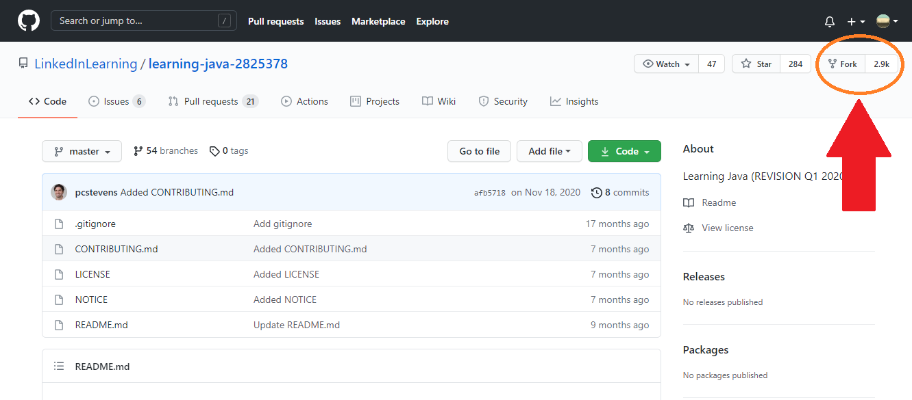

# How to fork a GitHub repository
Use this guide to create your own copy of an original repository (repo) without changing the original repo. Forking (creating a copy of) a developer’s original repo allows you to work on your own copy of the original repo. You can test changes, make improvements, or use the copy as inspiration for your own projects.

This guide references repos found on GitHub, a site that hosts open-source projects, such as software development projects, and offers version control. **This guide covers how to fork a repo both with and without using GitHub CLI.**

## Table of contents
[Glossary of terms](https://github.com/aerynk/portfolio-items/blob/main/fork-a-github-repo.md#glossary-of-terms)
[What you'll need before forking the repo](https://github.com/aerynk/portfolio-items/blob/main/fork-a-github-repo.md#what-youll-need-before-forking-the-repo)
  [What you'll need: without using GitHub CLI]()

## Glossary of terms
| Term     | Description |
| ----------- | ----------- |
| Clone | To download a copy of a repo to your local computer      |
| Fork     | To create a copy of an original (another user’s) repo     |
| Git  | The version control system used in this guide; a common version control system used among development teams       |
| GitHub CLI  | A GitHub tool that merges GitHub functionality and Git      |
| Open-source project | A project that is developed collaboratively, where the owner grants the right for other collaborators to use      |
| Repository (repo)  | A storage space for projects (files)       |
| Run  | The action of inputting a command into the terminal and pressing the Return key       |
| Terminal  | A way to refer to the Git window where the user inputs commands for the computer to execute      |
| Version control  | A way to track changes users make on projects      |

## What you'll need before forking the repo
#### What you'll need: without using GitHub CLI
- A GitHub account. To create a new account:
1. Navigate to [GitHub.com](https://github.com/).
2. Input your email into the white **Email address** field.
3. Select **Sign up for GitHub**.
4. Follow the prompts to create your account.
5. Verify your email according to the instructions.
- A GitHub repo. This guide used another user's repo, [LinkedInLearning - Learning Java](https://github.com/LinkedInLearning/learning-java-2825378).

#### What you'll need: using GitHub CLI
- A GitHub account. See the **[What you'll need: without using GitHub CLI](https://github.com/aerynk/portfolio-items/blob/main/fork-a-github-repo.md#what-youll-need-without-using-github-cli)** section to create a new account.
- A GitHub repo. This guide used another user's repo, [LinkedInLearning - Learning Java](https://github.com/LinkedInLearning/learning-java-2825378).
- GitHub CLI. Download GitHub CLI:
1. Navigate to the [GitHub CLI download site](https://cli.github.com/).
2. Select **Download for Windows**.
      - If you are using a different operating system, select **View installation instructions** and select the instructions link for the appropriate operating system.
      - The download should begin immediately.
3. Configure the download prompts for your project's needs. This guide used the default prompts.

- Git. To download Git:
1. Navigate to the [Git download site](https://git-scm.com/downloads).
2. Select the appropriate operating system for your computer. This guide used Windows.
3. Configure the download prompts for your project's needs. This guide used the default prompts.
4. In the final download prompt, check the box next to **Enable experimental support for pseudo consoles.** This will enable GitHub CLI.
5. Select **Install.**
- A source-code editor with embedded Git. This guide used Visual Studio Code. Install and configure Visual Studio Code:
1. Navigate to the [Visual Studio Code download site](https://code.visualstudio.com/).
2. Select **Download for Windows**.
      - If you are using a different operating system, select the drop-down arrow and choose the appropriate operating system.
      - The download should begin immediately.
3. Configure the download prompts for your project's needs. This guide used the default prompts.
4. Launch Visual Studio Code after the download is complete.
5. Inside Visual Studio Code, close the default tab.
6. Select the blue **Clone Repository** button.
7. Copy and paste the following URL into the gray search field:
     ~~~
     https://github.com/LinkedInLearning/learning-java-2825378
     ~~~
8. Select **Clone from URL**.
9. Follow the prompts to authenticate your GitHub account.
10. Your file manager window will appear. Select the folder location where you would like to store the cloned repo on your local computer.
- Authenticate GitHub CLI:
1. Open your file manager.
2. Locate where you stored the LinkedInLearning - Learning Java repo folder.
3. Right click on the folder.
4. Select **Git Bash Here**.
5. Verify you are on the master branch. See *Figure 1* for a visual of the terminal.
     
   *Figure 1*
6. Inside the Git terminal, run the following command:
   ~~~
   gh auth login
   ~~~
7. On the first prompt, select **GitHub.com** with the Return key.
8. On the next prompt, select **HTTPS** with the Return key.
9. On the next prompt, input **y**, then press the Return key.
10. On the next prompt, select **Login with a web browser** with the Return key.
11. Press the Return key.
12. Input the one-time code into your browser.
13. Follow the prompts to authenticate your GitHub account.
14. Inside the terminal, press the Return key. The terminal should now begin with the master branch line. See *Figure 1* for a visual of the master branch line.
## Forking the repo
#### Forking the repo: without using GitHub CLI
1. In your browser, log in to your GitHub account.
2. Navigate to the [LinkedInLearning - Learning Java](https://github.com/LinkedInLearning/learning-java-2825378) repo.
2. Near the top right of the screen, select **Fork**. See *Figure 2* to locate **Fork** on your screen.
   
   *Figure 2*

#### Forking the repo: using GitHub CLI
1. Open your file manager.
2. Locate where you stored the LinkedInLearning - Learning Java repo folder.
3. Right click on the folder.
4. Select **Git Bash Here**.
5. Verify you are on the master branch. See *Figure 1* for a visual of the terminal.
6. Inside the Git terminal, run the following command:
   ~~~
   gh repo fork
   ~~~
7. Select the appropriate base repo with the Return key.
   - The base repo is the repo your changes are based on.

## Work on Projects
That's it! You're ready to work on GitHub projects without making changes to the owner's repo.
Forking a repo using GitHub CLI gives you many more options for working on projects on your computer, but forking a repo without GitHub CLI gets you started quicker and avoids the need to download multiple programs.

---

Author: Aeryn Kauffman  
Last edited: 28-JUNE-2021  
Duration: ~6 hours  
Style guide: [Microsoft](https://docs.microsoft.com/en-us/style-guide/welcome/)
